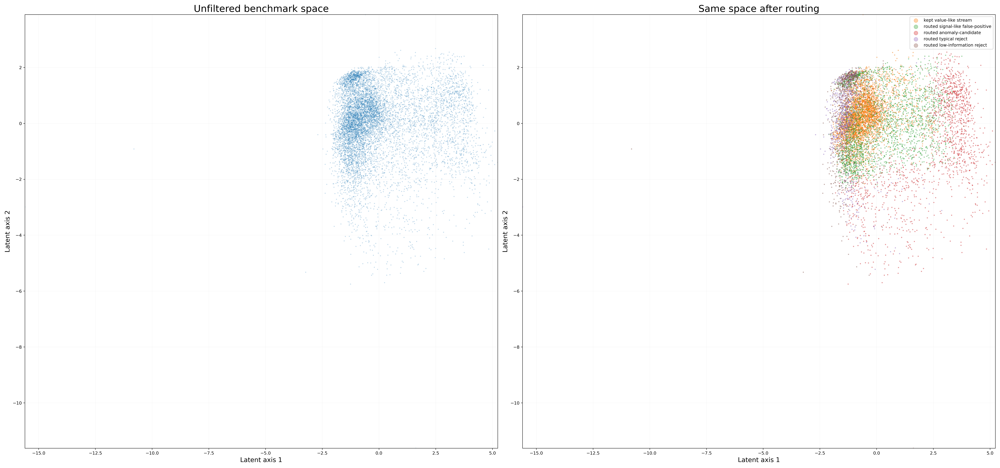
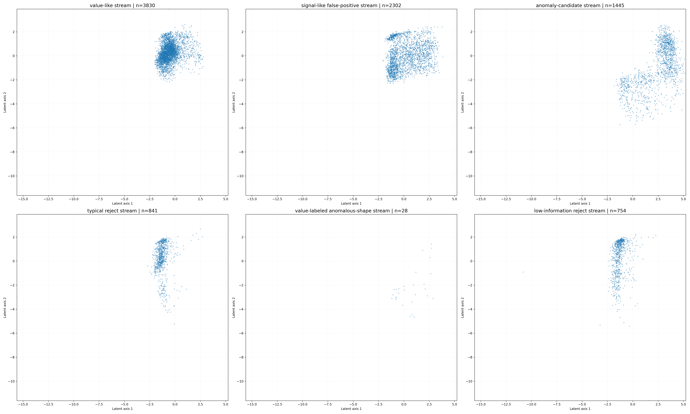
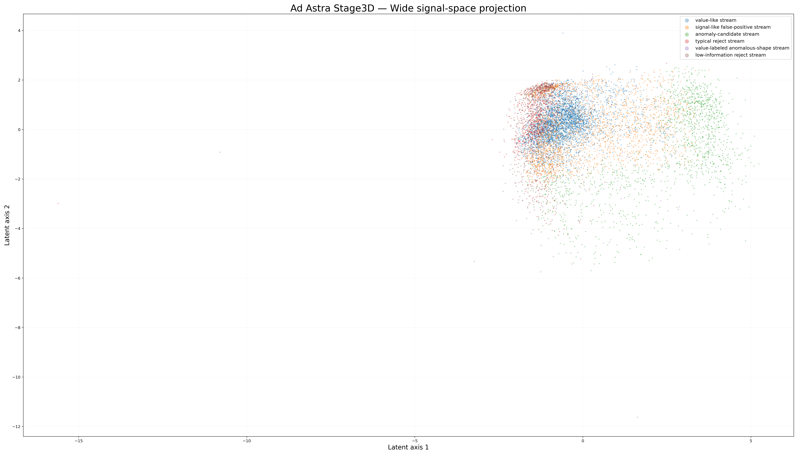

# Ad Astra — Public Evidence Package

This repository contains public, redacted benchmark evidence from the Ad Astra MCDO research project.

The package is evidence-first and does not disclose proprietary screening logic, scoring rules, routing rules, sensitive parameter values, feature weights, or implementation details.

## Public benchmark summary

On labeled Kepler KOI benchmark data, the screening layer preserved approximately 95% of value-labeled signals across 10 randomized holdout splits while reducing false-positive flow by approximately 51% and downstream workload by approximately 28%.

## Scope

This repository is intended as:
- public benchmark evidence,
- partner-review material,
- high-level reproducibility documentation,
- non-proprietary result summary.

## Not claimed

This repository does not claim:
- confirmed planet discovery,
- replacement of NASA pipelines,
- replacement of Bayesian inference,
- replacement of MCMC validation,
- public disclosure of the proprietary method.

## Included

- public English report,
- public Polish report,
- public aggregate benchmark metrics,
- public route summaries,
- public visual model outputs,
- SHA256 evidence files.

## Author

Michał Machura

## Visual Evidence

### Before vs after screening

### Signal-space route panels

### Wide signal-space projection

