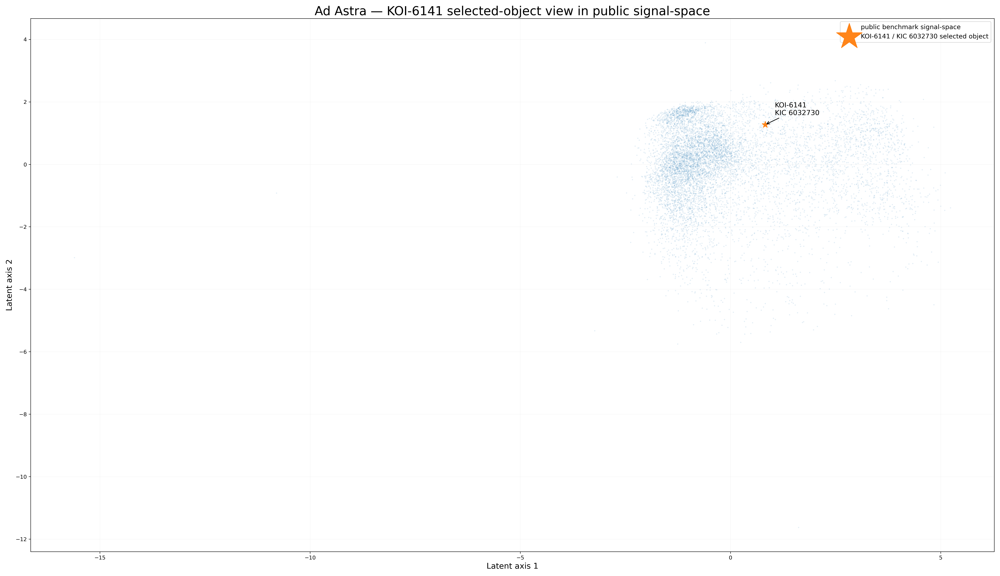

# KOI-6141 / KIC 6032730 — Public Case Study

## Object

KOI-6141 / KIC 6032730

NASA Exoplanet Archive overview:
https://exoplanetarchive.ipac.caltech.edu/overview/KOI-6141

ADS literature search:
https://ui.adsabs.harvard.edu/search/q=KIC%206032730&sort=date%20desc%2C%20bibcode%20desc&p_=0

## Why this object was selected

The object appeared in the benchmark output as a high-priority example for follow-up inspection. The public benchmark layer does not disclose the internal selection method.

The purpose of this case study is not to claim a discovery. The purpose is to show that a lightweight screening and routing workflow can surface a specific catalog object that is worth additional review.

## Public NASA archive observations

The NASA Exoplanet Archive page lists KOI-6141.01 as a Candidate Planet with a reported orbital period of approximately 96.509 days.

The public archive values shown for this candidate include unusual or internally suspicious fitted parameters, including:

- candidate status: Candidate Planet
- method: Transit
- period: approximately 96.509 days
- stellar radius listed in available solutions: about 1.88 to 2.52 solar radii
- reported transit duration: about 0.589 hours
- reported depth: about 0.1528 percent
- reported impact parameter: about 3.63
- reported planet radius in one solution: about 860 Earth radii
- reported radius ratio Rp/R*: about 2.66

## Interpretation

These values do not support a simple normal planet interpretation without further vetting.

In particular, a reported radius ratio greater than one and an impact parameter substantially above one are strong indicators that the catalog-level fit or object interpretation requires caution.

Possible explanations include:

- problematic model fit,
- blended source,
- eclipsing binary contamination,
- centroid or aperture contamination,
- instrumental or pipeline artifact,
- non-standard false positive,
- object requiring deeper archive-level review.

## What this demonstrates

This case study demonstrates that the public benchmark workflow can move from aggregate signal-space structure back to a concrete Kepler object.

It shows a practical triage path:

1. public signal-space benchmark,
2. selected object,
3. NASA archive lookup,
4. catalog-level consistency check,
5. follow-up priority assessment.

## What this does not demonstrate

This case study does not claim:

- a confirmed planet,
- a new astrophysical discovery,
- replacement of NASA validation tools,
- replacement of centroid, pixel-level, Bayesian, or MCMC validation.

## Recommended next checks

A proper follow-up review would require:

- Kepler Data Validation report review,
- light-curve inspection,
- odd/even transit comparison,
- secondary eclipse check,
- centroid and aperture contamination check,
- nearby-source review,
- literature review,
- independent archive cross-match.

## Figure

